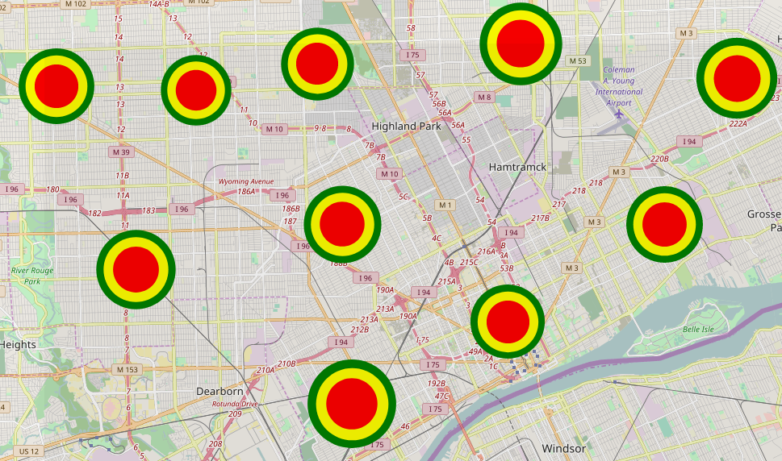
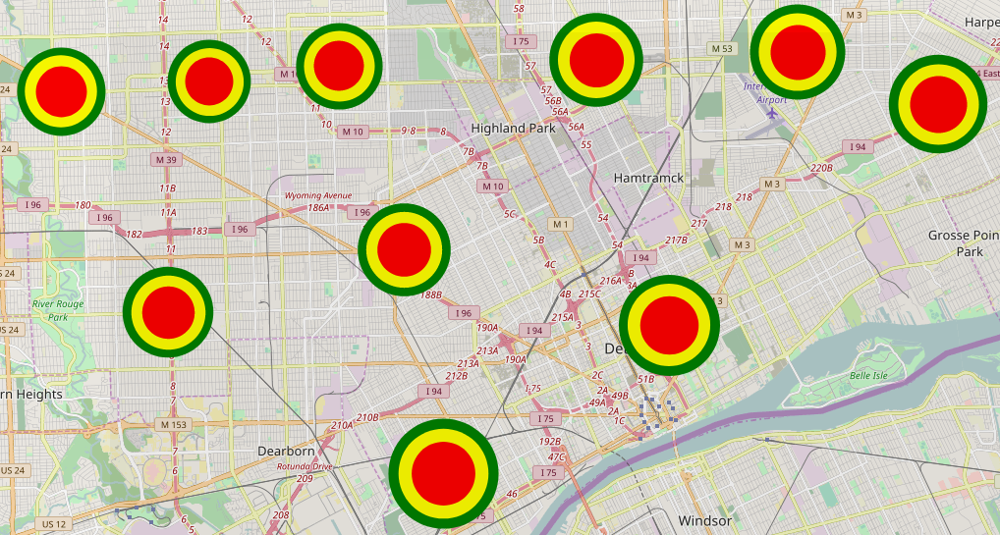
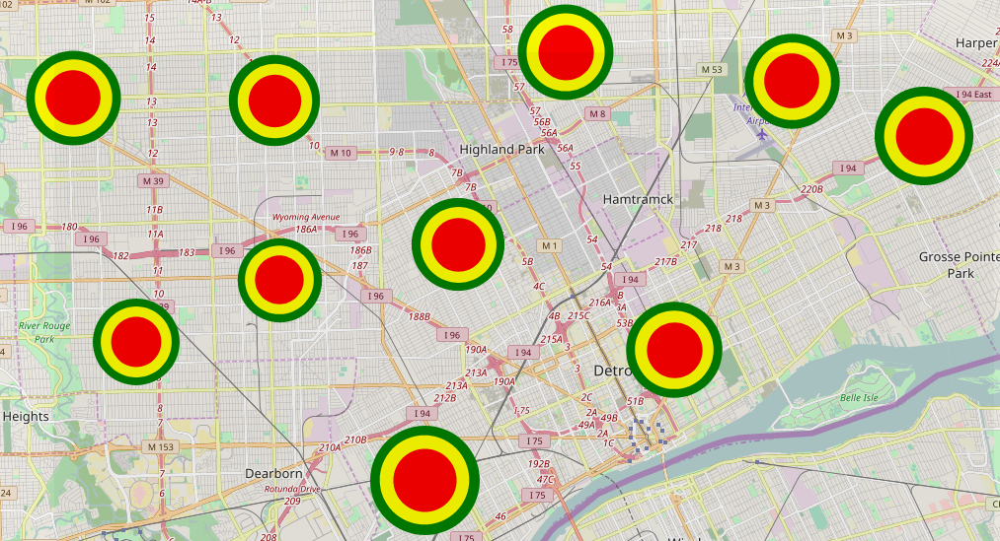
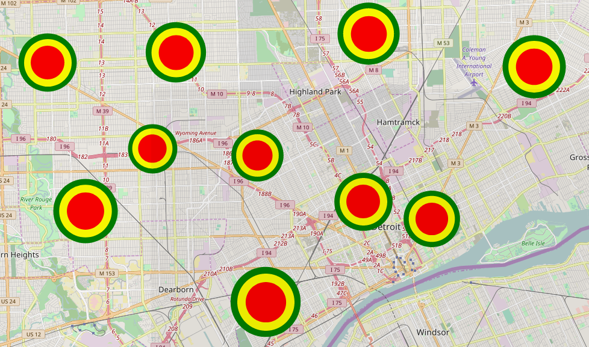
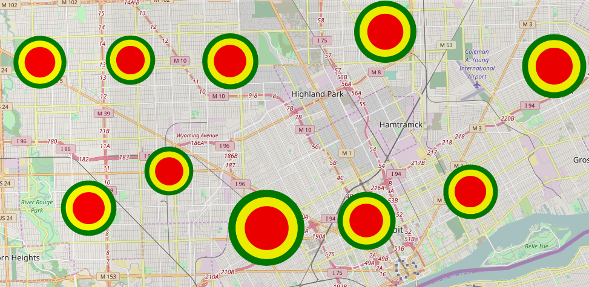
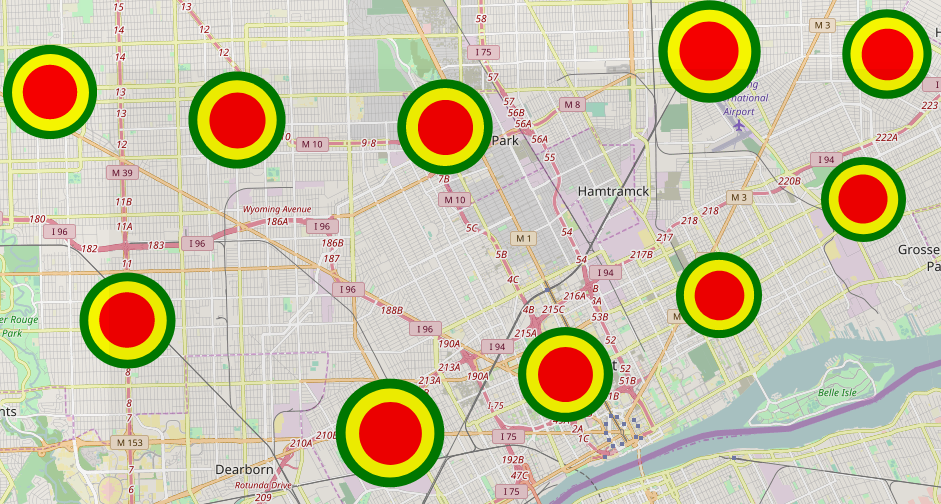

# CloudCrime
COMP4651 course project @ HKUST.

Harnessing the power of Spark's __Mllib__ library and __matplotlib__ to make you feel saver while travelling!

# Heat Maps For Each Category
## All Cagegories

## LARCENY

## ASSAULT AND BATTERY/SIMPLE ASSAULT

## DAMAGE TO PROPERTY

## BURGLARY

## AGG/FEL ASSAULT

## VEHICLE THEFT

## WARRANTS

## FRAUD

## ROBBERY

## TELEPHONE USED FOR HARASSMENT

## CONTRIBUTORS:
- Budi RYAN (bryanaa) (https://github.com/budiryan)
- Dicky CHIU (mtchiu) (https://github.com/Dickyhaha)
- Mikaela UY (mauy) (https://github.com/mikacuy)

